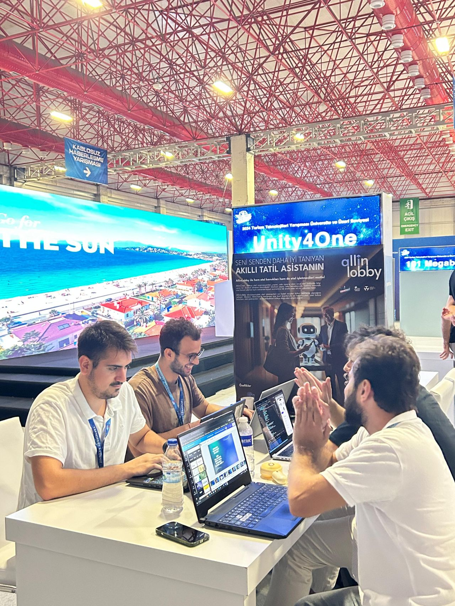

# AllinLobby Ecosystem

## Overview

**AllinLobby** is an ecosystem that incorporates multiple hotels, aiming to enhance and personalize the guest's stay experience by activating the hotel’s dedicated panel during the user's reservation period. The system is designed to improve the overall hospitality experience by offering personalized services and real-time interaction.

## Key Features

- **Personalized Experience**: During the guest's reservation dates, the relevant hotel panel is activated, providing customized services for a more tailored experience.
  
- **Hotel Navigation and Services**: Guests can access features such as personalized day plans, hotel navigation, shared space occupancy analysis, room service, and cleaning status.

- **Comprehensive Chatbot**: A powerful chatbot assists with various hotel processes, ensuring a smooth and interactive guest experience.

- **Nearby Hotel Booking**: When users are not within their reservation period, they can explore and book nearby hotels within the ecosystem.

---

## Team

Our dedicated team developed AllinLobby to provide an innovative solution for improving the hospitality experience.

---

## Contact

For more details or inquiries, feel free to reach out!

---

Thank you for exploring the **AllinLobby Ecosystem**!

---
---
---

# AllinLobby Ekosistemi

## Genel Bakış

**AllinLobby**, birçok oteli bünyesinde barındıran bir ekosistemdir. Kullanıcının rezervasyon tarihlerinde ilgili otelin panelini aktif hale getirerek, konaklama deneyimini kişiselleştirmeyi ve iyileştirmeyi hedefler. Bu sistem, misafirlerin konaklamalarını daha etkili ve kişisel hale getirmek için gerçek zamanlı etkileşim ve hizmetler sunar.

## Temel Özellikler

- **Kişiselleştirilmiş Deneyim**: Misafirin rezervasyon tarihleri boyunca ilgili otelin paneli aktif hale gelir ve kişiye özel hizmetler sunulur.
  
- **Otel Navigasyonu ve Hizmetler**: Misafirler, kişiselleştirilmiş günlük planlar, otel içi navigasyon, ortak alanların doluluk analizi, oda servisi ve temizlik durumu gibi özelliklere erişebilirler.

- **Kapsamlı Chatbot**: Güçlü bir chatbot, otel süreçlerine yardımcı olarak misafirlerin interaktif ve sorunsuz bir deneyim yaşamasını sağlar.

- **Yakındaki Otellerin Rezervasyonu**: Rezervasyon süresi dışında, kullanıcılar AllinLobby ekosistemindeki diğer otelleri keşfedebilir ve rezervasyon yapabilirler.

---

## Ekip

AllinLobby'yi geliştirerek, konaklama deneyimini iyileştirmeye yönelik yenilikçi bir çözüm sunduk.

---

## İletişim

Daha fazla bilgi almak veya sorularınız için bizimle iletişime geçebilirsiniz!

---

**AllinLobby Ekosistemi'ni** incelediğiniz için teşekkür ederiz!
